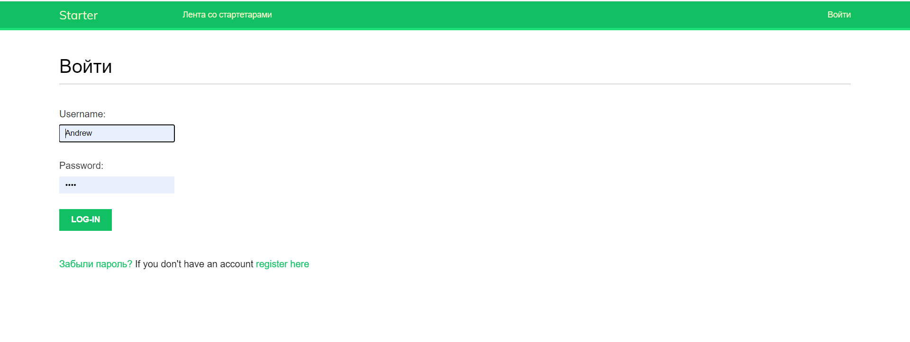
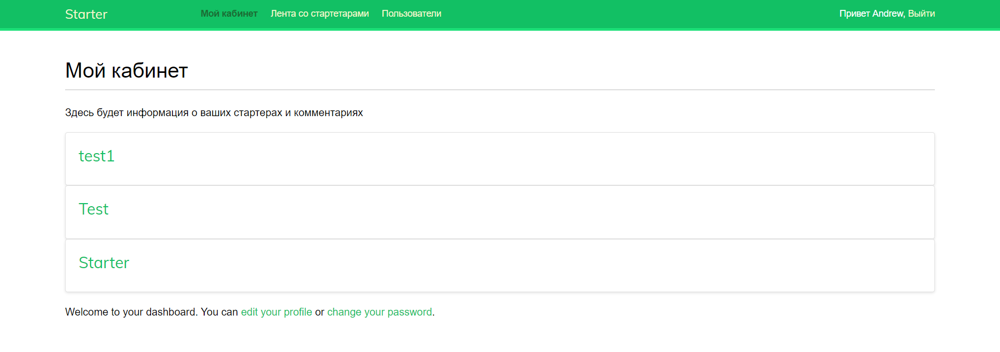
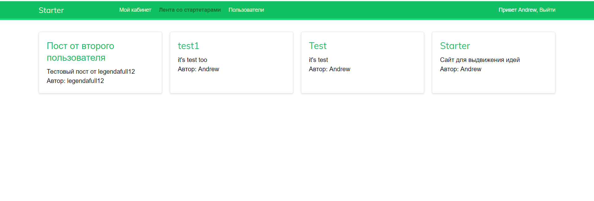

# Добро пожаловать на сайт для выдвижения своих проектов и поиска единомышленников!




Этот репозиторий содержит исходный код и ресурсы для нашего веб-сайта, который предоставляет платформу для представления своих проектов и поиска партнеров для совместной работы над ними.

## Основные функции, которые будут реализованы в ближайшее время

- **Профили пользователей**: Зарегистрированные пользователи могут создавать профили, загружать информацию о себе и своих проектах.

- **Добавление проектов**: Пользователи могут добавлять информацию о своих проектах, включая название, описание, цели и требуемые навыки.

- **Поиск единомышленников**: Система поиска позволяет пользователям находить проекты, которые соответствуют их интересам и навыкам.

- **Обмен сообщениями**: Зарегистрированные пользователи могут общаться друг с другом через встроенную систему обмена сообщениями для обсуждения сотрудничества.

## Установка и запуск

1. **Клонирование репозитория**: Вы можете клонировать этот репозиторий на свой компьютер с помощью следующей команды Git:

   ```bash
   git clone https://github.com/yourusername/yourproject.git

2. **Установите все зависимости** Вы должны прописать следующую команду:
   ```bash
   pip install -r requirements.txt
3.**Запустите приложение**
   ```bash
   ...\ITsite\djangosite>python manage.py runserver
